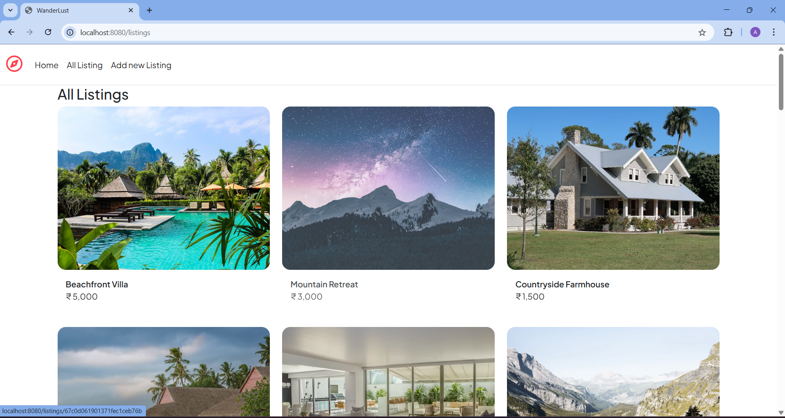
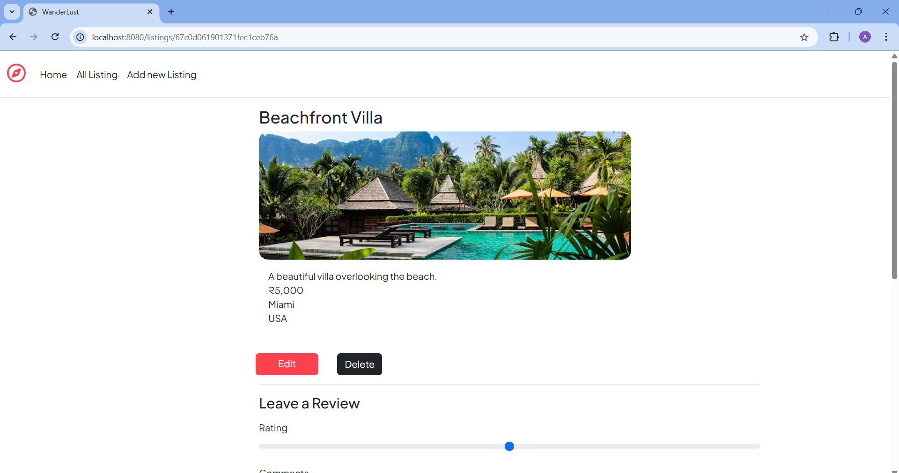
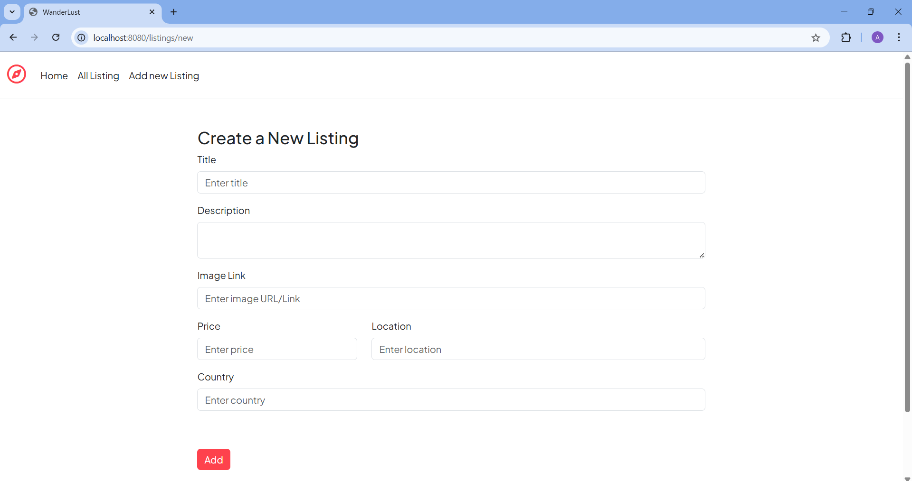

# 🌍 Wanderlust

A full-stack travel listings web application where users can:

- View travel destination listings
- Create new listings
- Edit & delete listings
- Leave reviews

---

## 🛠️ Built With

- Node.js
- Express.js
- MongoDB & Mongoose
- EJS
- Bootstrap 5
- Cloudinary (for image upload)
- Mapbox (for map rendering)

---

## 🚀 How to Run Locally

```bash
git clone https://github.com/2101Abhishek/wanderlust.git
cd wanderlust
npm install
npm start

---

## 📸 Screenshots

### 🏠 Home Page
[](./public/screenshots/home.png)

### 📋 Listings Page
[](./public/screenshots/listing.png)

### ➕ Add New Listing
[](./public/screenshots/new-listing.png)

